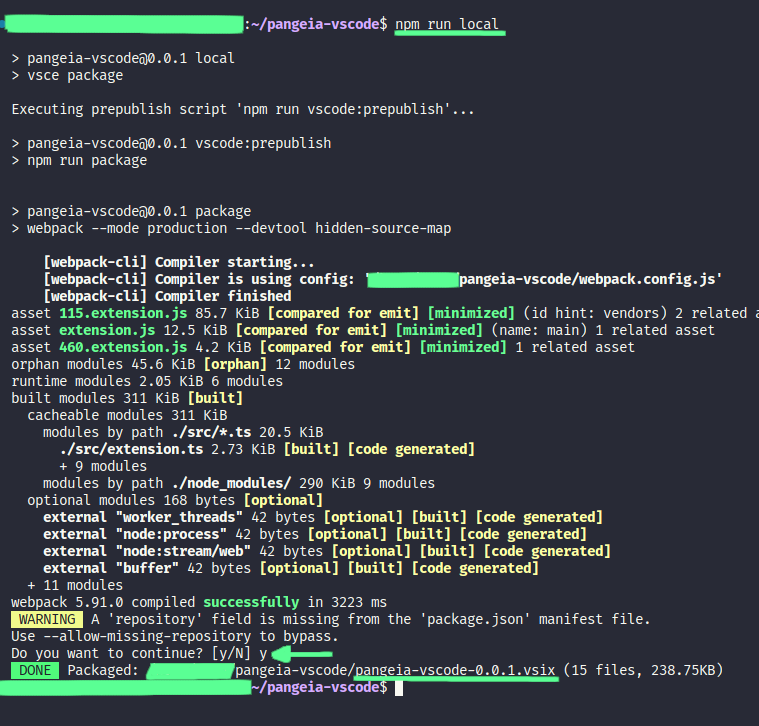
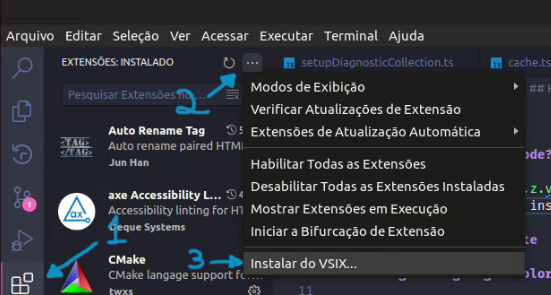
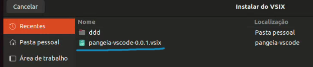
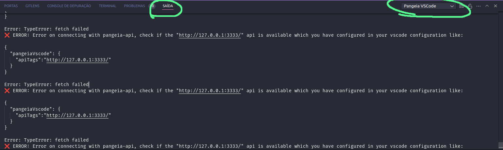

# pangeia-vscode

## Requirements

This project requires node 18 and url API pangeia-api, example `http://localhost:3333/` if pangeia-api run in your localhost

## How install in my vscode?

1. Run `npm install`
2. Generate `pangeia.x.y.z.vsix` file with `npm run local`



3. In vscode extensions, install from vsix



4. Choice `.visx file`



5. Restart your IDE, and follow output tab from vscode



6. Set pangeiaVscode config, or use default, default is `http://127.0.0.1:3333`

## How set custom config?

1. In Ubuntu `ctrl` + `p`


2. And add this config, put apiTags to `pangeia-api`, example:

```json
{
  "pangeiaVscode": {
    "apiTags": "http://127.0.0.1:3333"
  }
}
```
