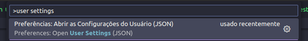

# pangeia-vscode

## Configure auto complete

## Configure highlight colors

## Configure url scrapper

In Ubuntu `ctrl` + `p`



and add this config, put apiTags to `pangeia-api`, exemple:

```json
{
  "pangeiaVscode": {
    "apiTags": "http://127.0.0.1:3333/schemas/tags"
  }
}
``
```
